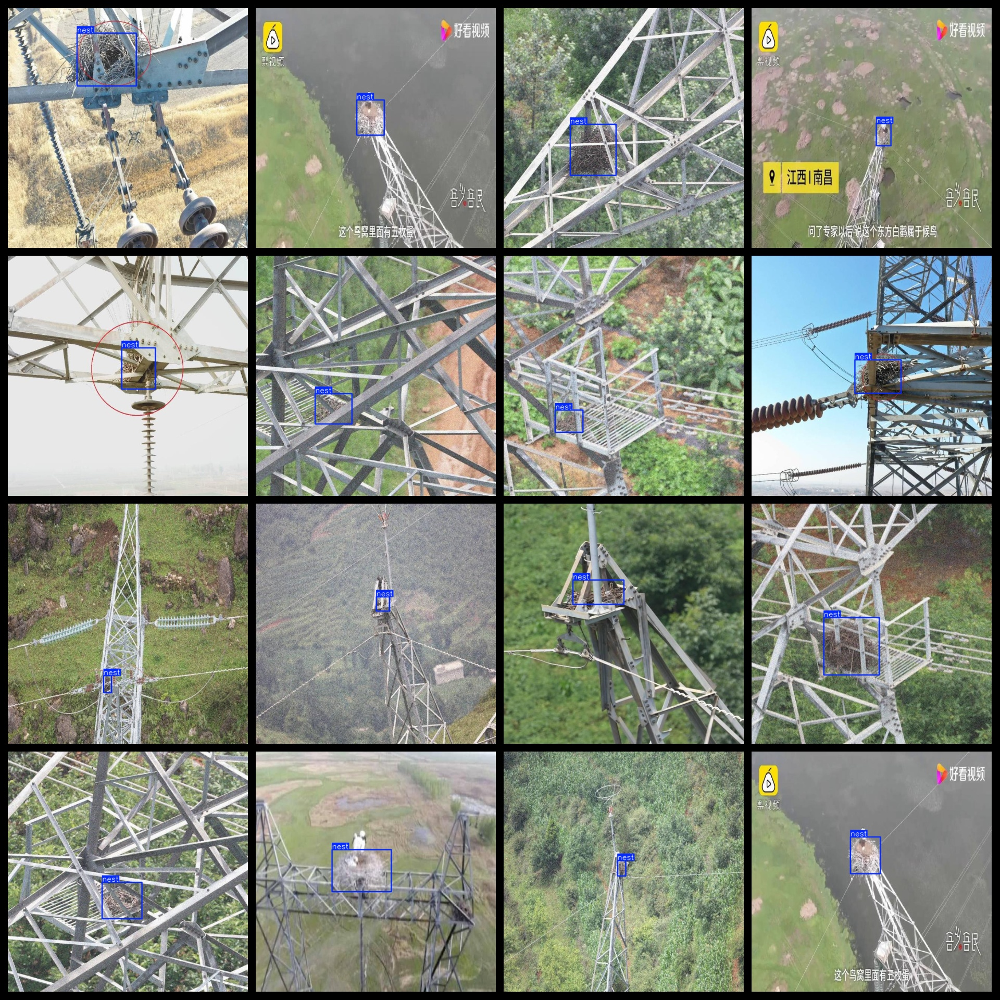

# Transmission Tower on Bird Nest Detection Dataset 648 imagesVOC+YOLO format

The dataset of bird nest detection on power poles includes 648 images in VOC+YOLO format.

Dataset format: Pascal VOC format + YOLO format (the txt file does not contain the split path, it only contains jpg images and corresponding VOC format xml files and yolo format txt files)

Number of images (number of jpg files): 648

Number of XML files: 648

Number of txt files: 648

Number of categories: 1

The Github repository is: datasets_sl

Annotation class names: ["nest"]

Number of boxes labeled in each category:

Nesting levels = 661

Total frames: 661

Number of images per category:

Nests have 648 images.

Image resolution: 640x640

Use the labeling tool: labelImg

Dataset Augmentation: No

Rules for annotation: Draw a rectangle around the category.

Important note: The dataset does not have been divided into training, validation, and testing sets.

Special Disclaimer: This dataset does not guarantee the accuracy of the trained models or weight files.

Annotation and image details are as follows:

## Images

---

Here is a pay link on Stripe (https://buy.stripe.com/3cs8yP7sY87d0vu9AB). Please contact me lonlonago@foxmail.com after funding $89, and I will send you a complete data files, thank you!

